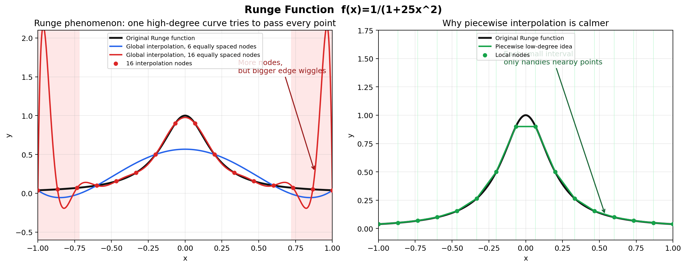

# 2.12 分段三次 Hermite 插值及误差推导

## 题目要求
求函数 $f(x) = x^4$ 在 $[a, b]$ 上的分段 3 次 Hermite 插值函数 $\Psi_n(x)$，并作误差估计。

---

## 知识点解析

这些知识点主要用于根据已知节点或函数条件构造插值多项式，并进一步估计误差、分析插值性质或计算函数近似值。做题时通常先判断适合哪一种插值形式，再构造多项式，最后结合余项或性质完成证明与估计。

### 1. 分段 3 次 Hermite 插值
在区间 $[a, b]$ 上对函数进行插值时，全区间使用高次多项式往往会导致“龙格现象”（严重震荡）。为此常采用**分段插值**。
假设将 $[a, b]$ 划分为 $n$ 个小区间 $[x_i, x_{i+1}]$（其中 $x_0=a, x_n=b$）。在每一个子区间 $[x_i, x_{i+1}]$ 上，构造一个不超过 3 次的多项式 $H_3(x)$，使其满足在端点 $x_i$ 和 $x_{i+1}$ 处的函数值和一阶导数值与原函数 $f(x)$ 相同。这样拼接起来的函数就叫分段三次 Hermite 插值函数 $\Psi_n(x)$。

### 2. 什么是龙格现象

龙格现象指的是：在一个较大的区间上，用越来越高次的插值多项式去插值时，插值多项式不一定越来越接近原函数，反而可能在区间两端附近出现越来越剧烈的振荡。

它最经典的例子是 Runge 函数：

$$
f(x)=\frac{1}{1+25x^2},\qquad x\in[-1,1]
$$

如果在 $[-1,1]$ 上取等距节点，用一个高次插值多项式去通过所有节点，那么随着节点数增加，插值多项式的次数也升高。直觉上好像点越多越准确，但实际情况可能是：

- 在区间中间附近，插值效果还可以；
- 在区间两端附近，插值曲线会明显上下摆动；
- 节点越多，高次插值多项式在端点附近的震荡可能越严重。

这就是龙格现象。

用图像来想象：原函数 $f(x)=\frac{1}{1+25x^2}$ 是一条平滑的钟形曲线，中间高、两边低。但高次插值多项式为了强行穿过许多等距节点，会在靠近 $-1$ 和 $1$ 的地方出现大幅度“上下波动”，看起来像曲线被拉得过头了。

下面这张图就是用 Python 画出的龙格现象示意图：



图中左边黑线是真正的 Runge 函数，红线是用 16 个等距节点做全局高次插值得到的多项式。可以看到，虽然红线经过了所有红色节点，但在区间两端附近明显出现了剧烈震荡。

左图的意思是：红线只有一条，它要同时照顾从 $-1$ 到 $1$ 的所有节点。为了穿过中间的点、左边的点、右边的点，它会在整个区间里互相牵扯。这样一来，某些地方虽然节点被穿过了，但节点之间的曲线可能被拉得很高或压得很低，特别是在区间两端附近最明显。

右边绿色线表示“分段低次”的思想。图中一条条浅绿色竖线可以理解为把大区间切成很多小区间：

$$
[-1,1]=[x_0,x_1]\cup[x_1,x_2]\cup\cdots\cup[x_{n-1},x_n]
$$

分段低次插值不是用一条很高次的多项式管完整个区间，而是在每一个小区间 $[x_i,x_{i+1}]$ 上单独构造一个低次多项式。

最简单的分段线性插值是这样做的：在 $[x_i,x_{i+1}]$ 上，只用两个端点

$$
(x_i,f(x_i)),\qquad (x_{i+1},f(x_{i+1}))
$$

连成一条直线。这个小区间里的曲线只由这两个附近的点决定，远处的点不会来影响它。

分段三次 Hermite 插值比直线更精细一点。在每个小区间 $[x_i,x_{i+1}]$ 上，它使用四个局部条件：

$$
H_i(x_i)=f(x_i),\qquad H_i(x_{i+1})=f(x_{i+1})
$$

$$
H_i'(x_i)=f'(x_i),\qquad H_i'(x_{i+1})=f'(x_{i+1})
$$

也就是说，它不仅要求小区间两端的函数值对上，还要求两端的斜率也对上。这样每一段都是一个三次多项式，既比直线更光滑，又不会像全局高次多项式那样被远处节点拖着到处震荡。

所以右图想表达的是：每个小区间只处理附近的点，因此曲线不会为了照顾远处节点而在端点附近大幅摆动。

生成这张图的脚本放在：

```text
第二章/scripts/plot_runge_phenomenon.py
```

龙格现象说明了一件很重要的事：

$$
\text{插值节点变多，并不一定意味着整体插值效果变好。}
$$

特别是使用等距节点做全局高次插值时，风险更明显。

### 3. 为什么分段插值可以缓解龙格现象

龙格现象的主要问题来自“全局高次多项式”：在整个区间上只用一个很高次的多项式，它为了照顾所有节点，容易在局部产生剧烈震荡。

分段插值的思路是：不要在整个区间上硬凑一个高次多项式，而是把大区间切成许多小区间，在每个小区间上只用低次多项式。

例如分段三次 Hermite 插值就是：

- 把 $[a,b]$ 分成许多小区间 $[x_i,x_{i+1}]$；
- 每个小区间上只构造一个三次多项式；
- 每段只负责局部两个端点的信息；
- 最后把这些低次多项式拼接起来。

这样做的好处是：每一段的多项式次数固定为 3，不会因为节点总数增加而变成很高次多项式。因此它既能保持局部拟合的灵活性，又能避免全局高次插值带来的剧烈震荡。

通俗地说，全局高次插值像是用一根很长、很硬的尺子同时贴合所有点；分段插值则像是用很多短尺子分别贴合局部，每一小段更容易贴稳。

### 4. Hermite 插值余项与巧妙解法
根据插值余项定理，对于 $[x_i, x_{i+1}]$ 上的三次 Hermite 插值多项式 $H_3(x)$，由于其在端点 $x_i$ 和 $x_{i+1}$ 处不仅函数值相等，**一阶导数也相等**。
这意味着在当前子区间上：
- $x_i$ 是一个**二重节点**（提供2个条件）。
- $x_{i+1}$ 也是一个**二重节点**（提供2个条件）。

共计 4 个插值条件。因此其余项的节点多项式部分包含了这两个节点的平方，误差（余项）表示为：
$$ R_3(x) = f(x) - H_3(x) = \frac{f^{(4)}(\xi)}{4!} (x - x_i)^2 (x - x_{i+1})^2 $$
当原函数 $f(x)$ 刚好也是 4 次多项式时，它的四阶导数是一个常数。这让我们可以跳过繁琐的基函数公式，直接利用余项定理**反求**插值多项式，和题目 2.9 的思路如出一辙。

---

## 解题过程

**第一部分：求分段插值函数 $\Psi_n(x)$**

设将区间 $[a, b]$ 划分为 $n$ 个子区间，节点依次为 $a = x_0 < x_1 < x_2 < \dots < x_n = b$。
考虑在任意一个子区间 $[x_i, x_{i+1}]$ 上，我们需要构造一个 3 次多项式 $H_3(x)$ 满足插值条件。

根据 Hermite 插值余项定理：
$$ f(x) = H_3(x) + R_3(x) $$
其中 $R_3(x) = \frac{f^{(4)}(\xi)}{4!} (x - x_i)^2 (x - x_{i+1})^2$。

已知 $f(x) = x^4$，对其连续求导：
- $f'(x) = 4x^3$
- $f''(x) = 12x^2$
- $f'''(x) = 24x$
- $f^{(4)}(x) = 24$

因为四阶导数恒等于常数 24，所以无论 $\xi$ 是多少，$f^{(4)}(\xi) = 24$。且 $4! = 24$。
所以插值余项严格等于：
$$ R_3(x) = \frac{24}{24} (x - x_i)^2 (x - x_{i+1})^2 = (x - x_i)^2 (x - x_{i+1})^2 $$

由此，可以直接倒推多项式：
$$ H_3(x) = f(x) - R_3(x) = x^4 - (x - x_i)^2 (x - x_{i+1})^2 $$

这就是在每个子区间上的表示。所以全局的分段三次 Hermite 插值函数 $\Psi_n(x)$ 可以表示为：
$$ \Psi_n(x) = x^4 - (x - x_i)^2 (x - x_{i+1})^2, \quad x \in [x_i, x_{i+1}], \quad i = 0, 1, \dots, n-1 $$

**第二部分：误差估计**

由前文推导可知，局部插值误差刚好就是余项：
$$ E(x) = f(x) - \Psi_n(x) = (x - x_i)^2 (x - x_{i+1})^2, \quad x \in [x_i, x_{i+1}] $$

我们需要估计 $|E(x)|$ 的上限。
令 $g(x) = (x - x_i)^2 (x - x_{i+1})^2 = [(x - x_i)(x_{i+1} - x)]^2$。
由基本不等式，对于 $x \in [x_i, x_{i+1}]$：
$$ (x - x_i)(x_{i+1} - x) \le \left( \frac{(x - x_i) + (x_{i+1} - x)}{2} \right)^2 = \frac{(x_{i+1} - x_i)^2}{4} $$
当且仅当 $x = \frac{x_i + x_{i+1}}{2}$ （即区间中点）时取等号。

因此对 $g(x)$ 进行平方，最大值为：
$$ |E(x)|_{\max} \le \left( \frac{(x_{i+1} - x_i)^2}{4} \right)^2 = \frac{(x_{i+1} - x_i)^4}{16} $$

如果我们令 $h = \max_{0 \le i \le n-1} (x_{i+1} - x_i)$ 为最大子区间步长，则在整个区间 $[a, b]$ 上有统一的误差界限：
$$ |f(x) - \Psi_n(x)| \le \frac{h^4}{16} $$

## 最终结论
1. 分段 3 次 Hermite 插值函数表达式为：当 $x \in [x_i, x_{i+1}]$ 时，
$$ \Psi_n(x) = x^4 - (x - x_i)^2 (x - x_{i+1})^2 $$
2. 误差估计为：
$$ |f(x) - \Psi_n(x)| \le \frac{h_i^4}{16} \le \frac{h^4}{16} $$
其中 $h_i = x_{i+1} - x_i$ 是当前子区间长度，$h$ 是最大步长。


